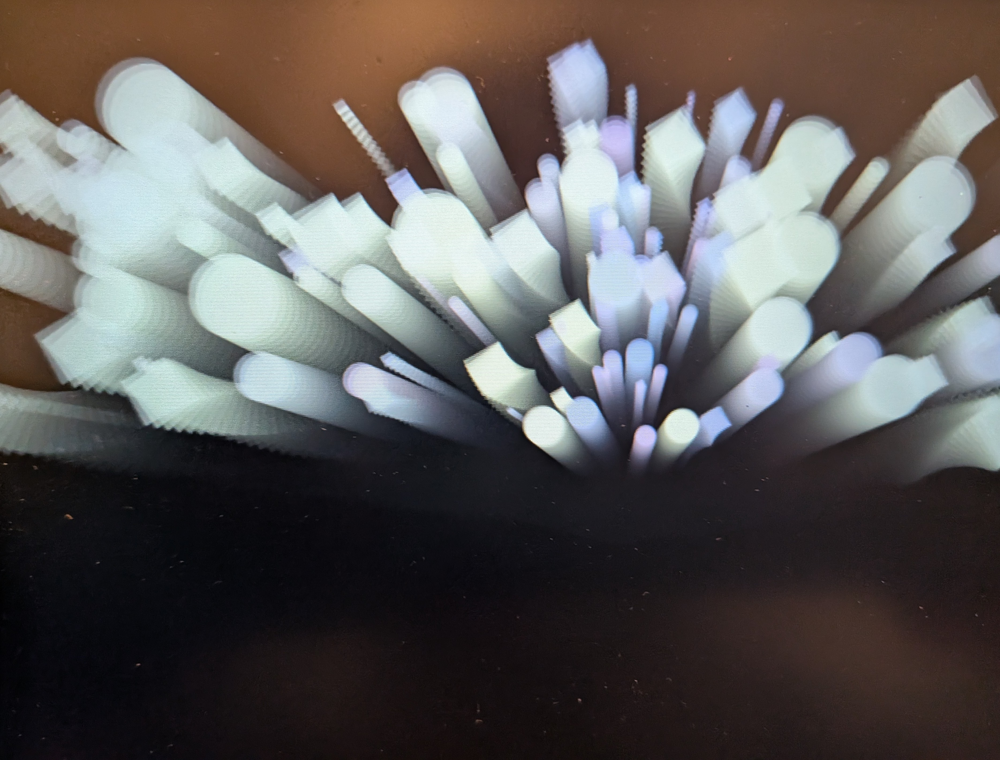

Breath Light

私たちは1日に約2万回、無意識に呼吸をしています。
このプロジェクトは、最も身近なインターフェースである「呼吸」を、ただの生理現象から「視覚的な癒やし」へと変換する実験です。
​「何もしない」を楽しむための、最も軽いOS。
インストールも、ログインも、設定も不要。
ただ、あなたの息を吹き込むだけ。

このページは、スマートフォンのマイクを使って「呼吸」を光として可視化する体験作品です。

使い方（スマホ推奨）
下記のURLを開きます
👉
https://editor.p5js.org/sorakinu/full/sketches
初回のみ
**「マイクの使用を許可」**してください
画面左上の 「p5」 をタップします
四角いボタンを押します
再生ボタン ▶ を押します
息を吐くと、ブレスが光として現れます
特徴
アプリのインストール不要
アカウント登録不要
スマホ1台で完結
呼吸という「最も身近な行為」を
視覚的な体験へ変換します
動作環境
スマートフォン（iPhone / Android）
最新の Chrome / Safari 推奨
マイク機能が有効な端末

注意事項
周囲が静かな環境の方が反応しやすくなります
マイク使用を拒否すると動作しません
PCでも動作しますが、スマホでの体験を推奨します
コンセプト
「呼吸は、すでに完成されたインターフェースである」
思考や操作を増やさず、
ただ息をするだけで体験が成立する
軽さを大切にしています。
作者
宙きぬ
（人生を軽くするOSを制作中）

Title
​Breath Light — Visualize your breath as light.
​
​Turn your breath into a visual experience. No install, no login, just breathe.
​Description 
​"Breathing is already a perfected interface."
​In our busy digital lives, we are constantly forced to tap, scroll, and think. Breath Light is an experimental art piece designed to "lighten" your life by returning to the most basic human act: breathing.
​This is not just a tool; it’s a moment of Zen. By using your smartphone’s microphone, your exhales are transformed into a soft, glowing light on the screen. No complex settings, no data tracking—just you and your breath.
​✨ Features
​Zero Friction: No app installation or account required. Works instantly in your browser.
​Minimalist Design: Focuses entirely on the interaction between your body and the light.
​Privacy First: Audio is processed locally for visualization and never recorded or stored.
​📱 How to Experience
​Open the URL on your smartphone (Safari/Chrome recommended).
​Allow microphone access.
​Tap "P5" and press the Play (▶) button.
​Breathe out slowly toward the microphone and watch the light emerge.
​💡 About the Author
​Created by Sorakinu, an artist/creator building an "OS to lighten your life."
